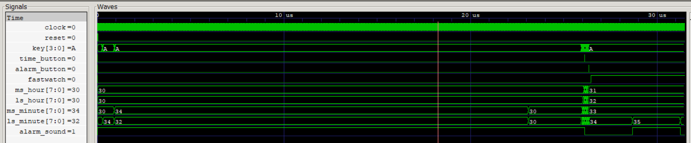
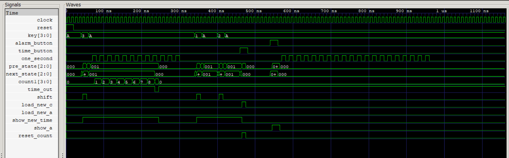
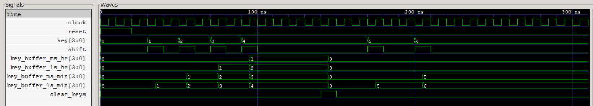

# Digital Alarm Clock – RTL Design (Verilog HDL)

A modular **24-hour digital alarm clock** implemented using **Verilog HDL**.  
The system is designed using a **hierarchical RTL architecture** and verified through simulation using module-level and system-level testbenches.

---

## Features

- 24-hour digital clock
- Alarm time configuration
- Alarm trigger when current time equals alarm time
- FSM-based keypad entry control
- Timeout protection for slow key entry
- Modular RTL architecture
- Complete verification using dedicated testbenches

---

## Project Architecture

The system consists of the following RTL modules:

### `timegen.v`
Generates second and minute pulses used for time progression.

### `counter.v`
Maintains the current time (hours and minutes).

### `fsm.v`
Controls keypad input flow, alarm configuration, and system state transitions.

### `keyreg.v`
Stores keypad digit inputs using a shift register mechanism.

### `alarm_reg.v`
Stores the configured alarm time.

### `lcd_driver.v`
Converts numerical values to display format.

### `lcd_driver_4.v`
Handles four-digit display output.

### `alarm_clock_top.v`
Top-level module integrating all system components.

---
## RTL Schematic


---

## Verification

Each module is verified using dedicated **Verilog testbenches**.
---
### Module Testbenches

- `timegen_tb.v` – verifies second and minute pulse generation  
- `counter_tb.v` – verifies time counting logic  
- `alarm_reg_tb.v` – verifies alarm time register functionality  
- `keyreg_tb.v` – verifies keypad shift register operation  
- `lcd_driver_tb.v` – verifies digit to display conversion  
- `lcd_driver_4_tb.v` – verifies four-digit display driver  
- `fsm_tb.v` – verifies FSM state transitions and timeout behavior  

### System Testbench

- `alarm_clock_top_tb.v` – verifies the complete alarm clock system

Waveforms are analyzed using **GTKWave**.

---

## Simulation Waveforms

### Top-Level System Verification


### FSM State Transition Verification


### Key Register Verification



---

## Design Flow

The digital alarm clock design follows a standard RTL design flow:

1. RTL design using Verilog HDL  
2. Module-level verification using dedicated testbenches  
3. System-level integration using a top module  
4. Functional simulation using Icarus Verilog  
5. Waveform analysis using GTKWave
---

## Simulation Flow

Simulation is performed using **Icarus Verilog**.

### Compile

```bash
iverilog -o sim *.v
```

### Run Simulation

```bash
vvp sim
```

### View Waveform

```bash
gtkwave alarm_clock_top.vcd
```
---
## FPGA Implementation Results

### Target Device

* Xilinx Artix-7 (`xc7a35ticpg236-1L`)

### Resource Utilization

| Resource        | Utilization |
| --------------- | ----------- |
| LUTs            | 106         |
| Flip-Flops (FF) | 75          |
| BRAM            | 0           |
| URAM            | 0           |
| DSP             | 0           |

The design occupies a small amount of FPGA resources, demonstrating an efficient RTL implementation suitable for low-cost FPGA devices.

---

## Tools Used

* Verilog HDL
* Icarus Verilog
* GTKWave
* AMD Vivado

---

## Project Structure

```
Digital-Alarm-Clock-RTL
│
├── src
│   ├── alarm_clock_top.v
│   ├── timegen.v
│   ├── counter.v
│   ├── fsm.v
│   ├── keyreg.v
│   ├── alarm_reg.v
│   ├── lcd_driver.v
│   └── lcd_driver_4.v
│
├── testbench
│   ├── timegen_tb.v
│   ├── counter_tb.v
│   ├── alarm_reg_tb.v
│   ├── keyreg_tb.v
│   ├── lcd_driver_tb.v
│   ├── lcd_driver_4_tb.v
│   ├── fsm_tb.v
│   └── alarm_clock_top_tb.v
│
├── waveform
│   ├── alarm_clock_top_waveform.png
│   ├── fsm_waveform.png
│   ├── keyreg_waveform.png
│   └── rtl_schematic.pdf
│
└── README.md
```

---

## Acknowledgments

This project is based on the **"Verilog HDL – Hands On"** course by **Maven Silicon**.
Additional modifications and verification work, including **module-level testbenches and system-level integration**, were implemented independently.

---

## Author

**Vishnu Vardhan**  
Electronics and Communication Engineering (ECE)
